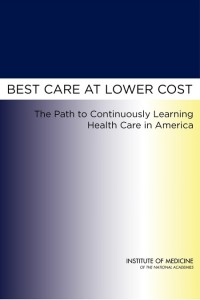
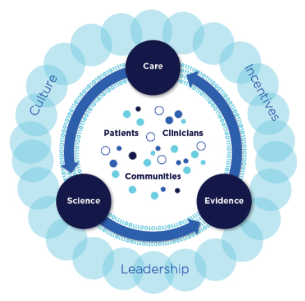
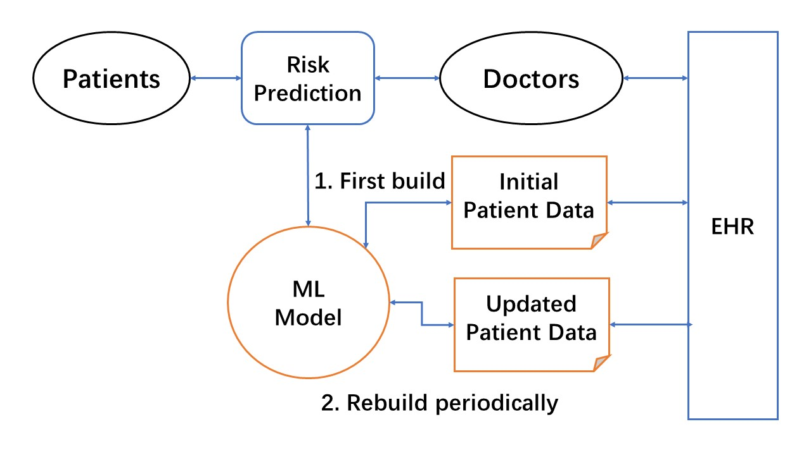
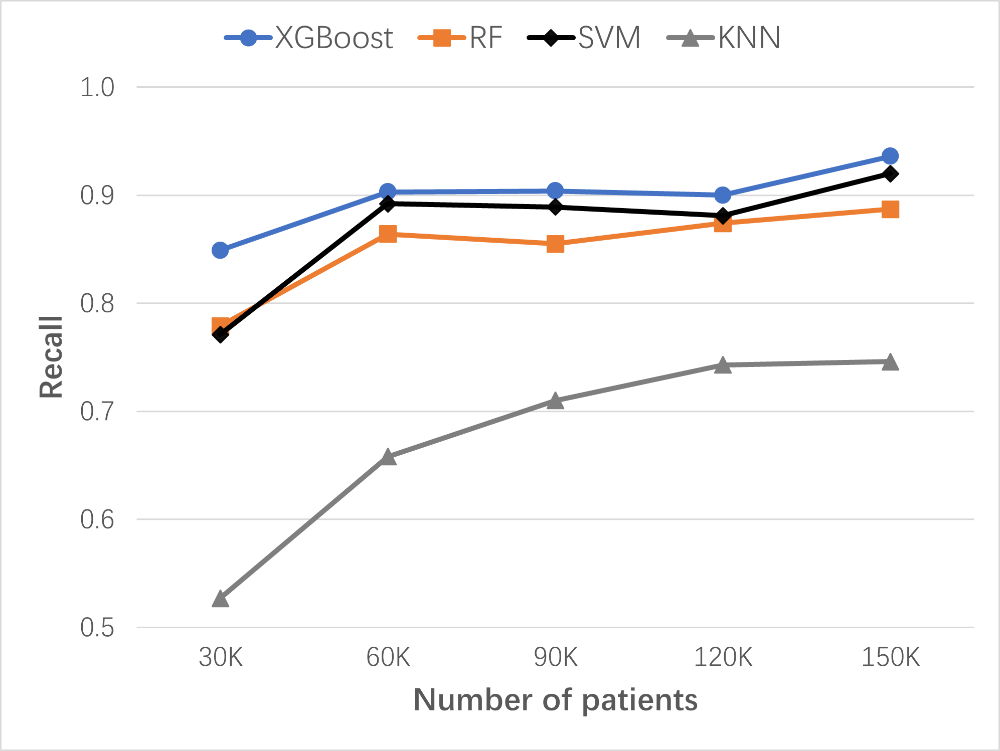
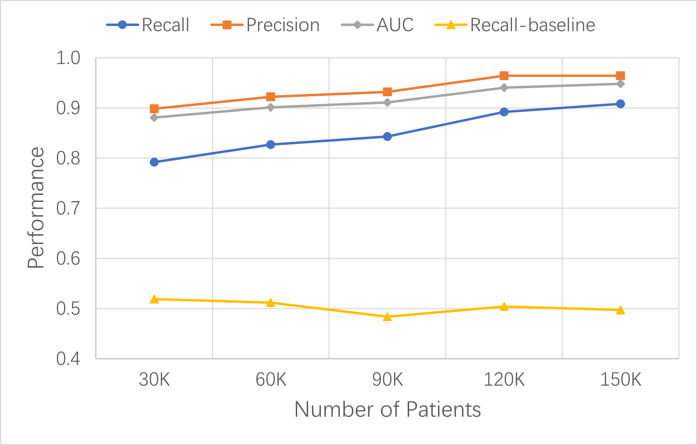

# Learning Health System Practical Guide

AJ Chen, PhD, Co-Chair of [LHS Tech Forum Initiative](https://www.learninghealth.org/2020-lhs-technology-forum), Learning Health Community (nonprofit), Silicon Valley, California

[1/2/2023 Updated. Translation: [Chinese](index_zh.md)]

## Contents

1. [The vision of Learning Health Systems](#1-the-vision-of-learning-health-systems)
2. [Medical Evidence and Knowledge Generation](#2-medical-evidence-and-knowledge-generation)
3. [Medical Knowledge and Model Dissemination](#3-medical-knowledge-and-model-dissemination)
4. [Building Learning Health Systems](#4-building-learning-health-systems)
5. [ML-enabled LHS Simulation](#5-ml-enabled-lhs-simulation)
6. [ML-enabled LHS Project Examples](#6-ml-enabled-lhs-project-examples)
7. [Health Data](#7-health-data)
8. [Synthetic Patient Data](#8-synthetic-patient-data)
9. [LHS as Healthcare AI Framework](#9-lhs-as-healthcare-ai-framework)
10. [LHS Related Resources](#10-lhs-related-resources)

[References](#references)

# Summary

This Learning Health System (LHS) Quick Guide focuses on providing practical information for developers and health organizations to get started with developing LHS quickly.

The quick guide’s contents are based on my understanding and interpretation of the series of LHS reports from the US National Academy of Medicine (NAM) and the progress made so far in the emerging field of LHS. I believe NAM’s LHS vision and frameworks will guide the transformation of the current healthcare systems to the learning health systems not only in the US but also in the world.   

The guide first summarizes the NAM LHS reports to answer the fundamental questions: Why do we need LHS? What is LHS? Who is building LHS? 

Then, it briefly describes the recent technology developments needed to build small units of LHS with machine learning (ML). The highlight is the first ML-enabled LHS (ML-LHS) simulation using synthetic patient data, which is openly available at [Open Synthetic Patient Data](https://github.com/lhs-open/synthetic-data) on GitHub. For demonstration purposes, it shares example projects from hospitals building real patient ML-LHS units for different tasks such as disease risk prediction. A new "synthetic+real" strategy is proposed for building ML-LHS units more efficiently. 

The subsequent sections provide more detailed information on electronic medical record (EMR) or electronic health record (EHR) data, synthetic patients, data-driven machine learning, and other technology components essential for ML-LHS. 

The guide's primary goals are:

>1.	Provide technical information for developers and health organizations to quickly understand the benefits of LHS and get started with LHS.
>2. Explain it is more practical to build small ML-LHS units rather than being bogged down by the grand picture of LHS.
>3. Propose a new "synthetic+real" strategy: simulate ML-LHS units with synthetic patients first and then apply the process to build ML-LHS units with real EHR data.

The guide makes the following hypotheses about ML-LHS:

>1. ML-LHS Performance Hypothesis: Due to its inherent data-centric ML approach, ML-LHS can ultimately achieve high prediction performance (>95%) for most diseases and conditions. 
>2. ML-LHS Equity Hypothesis: ML-LHS over hospital-led clinical research networks can effectively enable small clinics with seamlessly disseminated ML models and thus help reduce health care disparities in underserved populations.
>3. ML-LHS AI Hypothesis: Because of the intrinsic advantage of having both data-driven and deployment-oriented approaches in ML-LHS, most EMR-based AI tools can be more efficiently and effectively developed and deployed in the form of ML-LHS. 

The [LHS Practical Guide](https://lhs-open.github.io/lhs-open/lhs-guide/) is part of the Open LHS Project on GitHub, aimed to encourage sharing and collaboration for research, development, and implementation of LHS in the emerging field of learning health systems. As a dynamic technical documentation for LHS, this guide is published on GitHub Pages and will be updated when new LHS information becomes available. 

---

### Next step

>After reading this quick practical guide, hopefully you will be more familiar with LHS and ready to try ML or ML-LHS. Since synthetic data may accelerate your project, you may first check the [Open Synthetic Patient Data](https://github.com/lhs-open/synthetic-data) GitHub repository and Harvard dataverse. If they do not have the data you need, you may email me (ajchen(at)web2express.org). Because of its extendable design, Synthea may model any diseases and conditions to generate the synthetic patient data you need. 

---

 

# 1. The vision of Learning Health Systems

## The LHS vision from NAM

>   “In a learning health system, science, informatics, incentives, and culture are aligned for continuous improvement and innovation, with best practices seamlessly embedded in the delivery process and new knowledge captured as an integral by-product of the delivery experience.”  (Source: NAM website - [The Learning Health System Series](https://nam.edu/programs/value-science-driven-health-care/learning-health-system-series/))

The LHS vision was created by NAM (formerly Institute of Medicine, IOM) and described in a series of reports from NAM. Below I will summarize the related information in the reports to show why LHS is needed and what LHS is. Some examples are also from the reports. For details, please see [The Learning Health System Series](https://nam.edu/programs/value-science-driven-health-care/learning-health-system-series/) on the NAM website.

## Why do we need LHS? 

 

In 2006 the IOM Roundtable on Evidence-Based Medicine convened a workshop entitled “The Learning Healthcare System,” from which the first NAM LHS report, "The Learning Healthcare System," was published in 2007. The report recognizes that the performance of the healthcare system remains far short of where it should be. After dissecting the clinical evidence generation and application process, the report envisions a new health care system in which evidence development and application flow seamlessly and continuously in the course of care, i.e., a learning health system.  

A re-evaluation of how health care is structured to develop and apply evidence subsequently identified the following problems in current health care systems:

>- Problem: Missed opportunities, preventable illnesses, and injuries are too often in health care.

Medical errors: IOM 2001 report “Crossing the Quality Chasm” found an estimated 44,000 to 98,000 Americans may die annually due to medical errors. This alarming problem underscored the need for redesigning health care to address the key dimensions where improvement was most needed: safety, effectiveness, patient centeredness, timeliness, efficiency, and equity (IOM 2001).

>- Problem: The prevailing approach to generating clinical evidence is inadequate today and may be irrelevant tomorrow, given the pace and complexity of change. 

The current dependence on the randomized controlled clinical trial (RCT), as useful as it is under the right circumstances, takes too much time, is too expensive, and is fraught with questions of generalizability.

Evidence lacking generalizability: Clinical research studies often do not reliably generate evidence that is generalizable for clinical decision making in real-world patient populations. The use of strict inclusion and exclusion criteria restricts a broader clinical population from participating in clinical studies. As such, even when lengthy clinical trials are completed, clinicians may not feel that study results can be applied to their own, often more complex, patient populations. For example, Masoudi and colleagues demonstrated that only a minority (13% to 25%) of persons with heart failure in clinical practice would qualify for enrollment in clinical trials (Masoudi 2003).

>- Problem: Deficiencies are in the quantity, quality, and application of evidence.

Improvement requires a stronger system-wide focus on the evidence. A new clinical research paradigm that takes better advantage of data generated in the course of healthcare delivery would speed and improve the development of evidence for real-world decision making.

>- Problem: The current approaches to interpreting the evidence and producing guidelines and recommendations often yield inconsistencies and confusion. Dissemination of guidelines is too slow.

One report suggested that it may take as long as 17 years to turn some positive research results to the benefit of patient care (Balas and Boren 2000). There is a need for reducing the lag time between innovation and its implementation.

>- Problem: Inefficiency and waste are in much of health care.

At the system level, it is clear that the clinical research enterprise is detached from the clinical care delivery process. The report proposes that embedding clinical research in clinical delivery may fix this foundational defect in the health care systems. Because simultaneous research and care makes continuous learning and dissemination more efficient and effective, it may drastically improve care quality and reduce cost at the same time, which is why we need learning health systems.

## What is LHS?

SOURCE: NAM 2007 LHS report “The Learning Healthcare System.”

The report proposes that by reengineering clinical research and healthcare delivery, the best evidence generation and application process will become natural and seamless components of the process of health care itself, as part of a learning healthcare system, which can be both more effective and more efficient than we have today. 

Learning Health System Characteristics:
>-  Culture: participatory, team-based, transparent, improving
>-  Design and processes: patient-anchored and tested
>-  Patients and public: fully and actively engaged
>-	Decisions: informed, facilitated, shared, and coordinated
>-	Care: starting with the best practice every time
>-	Outcomes and costs: transparent and constantly assessed
>-	Knowledge: ongoing, seamless product of services and research
>-	Digital technology: the engine for continuous improvement
>-	Health information: a reliable, secure, and reusable resource
>-	The Data utility: data stewarded and used for the common good
>-	Trust fabric: strong, protected, and actively nurtured
>-	Leadership: multi-focal, networked, and dynamic

The Office of National Coordinator (ONC) envisioned a nationwide learning health system (Friedman 2010). 

## Redefining LHS

[SOURCE: NAM 2013 report “Best Care at Lower Cost”]

In 2013, IOM produced another report to re-iterate its vision of LHS: “Best Care at Lower Cost: The Path to Continuously Learning Health Care in America.” It explores the imperatives for change, the emerging tools that make transformation possible, the vision for a continuously learning health care system, and the path for achieving this vision. 

 

Redefining the need for transforming the current “broken” healthcare systems to learning health systems:

>-	Need a new approach to medical knowledge generation and application.

The current approach to generating new medical knowledge falls short in delivering the evidence needed to support the delivery of quality care. The evidence base is inadequate, and methods for generating medical knowledge have notable limitations.

The gap between the evidence possible and the evidence produced continues to grow, and studies indicate that the number of guideline statements backed by evidence is not at the expected level. In some cases, 40 to 50 percent of the recommendations made in guidelines are based on expert opinion, case studies, or standards of care rather than on multiple clinical trials or meta-analyses.

The current research knowledge base provides limited support for answering important types of clinical questions, including those related to comparative effectiveness and long-term patient outcomes. 

The inadequacy of the evidence base for clinical guidelines has consequences for the evidence base for care delivered. Estimates vary on the proportion of clinical decisions in the United States that are adequately informed by formal evidence gained from clinical research, with some studies suggesting a figure of just 10-20 percent.

>-	Need rapid dissemination.

The example of the diffusion of the use of beta-blockers after heart attack is a success story in many ways: high-quality evidence was produced; it was incorporated into clinical care guidelines, quality improvement initiatives, and quality-of-care measures; and several health plans offered financial incentives for its uptake. Yet even with this level of effort, it took 25 years from the time the initial results were published until the time the treatment saw general use in clinical practice. This example speaks to the need to create infrastructure that makes the process of learning and improvement easier, so that the next discovery does not require 25 years of sustained effort before it is widely used to help patients.

>-	Need to control the unsustainable healthcare cost.

Improving quality and controlling costs requires moving from this unsustainable and flawed organizational arrangement to a system that gains knowledge from every care delivery experience and is engineered to promote continuous improvement. In short, the nation needs a health care system that learns, and a learning health care system is both possible and necessary for the nation today. 

**Definition of Learning Health Care System:**
> “A learning health care system is one in which science, informatics, incentives, and culture are aligned for continuous improvement and innovation, with best practices seamlessly embedded in the care process, patients and families active participants in all elements, and new knowledge captured as an integral by-product of the care experience.” (Source: NAM 2013 report – “Best Care at Lower Cost”)
 
 

**Schematic of a learning health system:** 
 

Source: NAM 2013 report “Best Care at Lower Cost.”

 

## Characteristics of a Continuously Learning Health Care System

[SOURCE: NAM 2013 report "Best Care at Lower Cost"] 

Science and Informatics:

-	Real-time access to knowledge — A learning health care system continuously and reliably captures, curates, and delivers the best available evidence to guide, support, tailor, and improve clinical decision making, care safety and quality.

-	Digital capture of the care experience — A learning health care system captures the care experience on digital platforms for real-time generation and application of knowledge for care improvement.

Patient-Clinician Partnerships:

-	Engaged, empowered patients — A learning health care system is anchored on patient needs and perspectives and promotes the inclusion of patients, families, and other caregivers as vital members of the continuously learning care team.

Incentives:

-	Incentives aligned for value — A learning health care system has incentives actively aligned to encourage continuous improvement, identify and reduce waste, and reward high-value care.

-	Full transparency — A learning health care system systematically monitors the safety, quality, processes, prices, costs, and outcomes of care, and makes information available for care improvement as well as informed choices and decision making by clinicians, patients, and their families.

Continuous Learning Culture:

-	Leadership-instilled culture of learning — A learning health care system is stewarded by leadership committed to a culture of teamwork, collaboration, and adaptability in support of continuous learning as a core aim.

-	Supportive system competencies — A learning health care system constantly refines complex care operations and processes through ongoing team training and skill building, systems analysis and information development, and creation of the feedback loops for continuous learning and system improvement.

## Who is building LHS?

LHS Examples:

-	Intermountain Healthcare: Create feedback loops to expedite study timeliness and relevance.
-	Geisinger Health System: Use of electronic health records to bridge the inference gap.
-	Department of Veterans Affairs: Implementing evidence-based practice, particularly via the use of the electronic health record.

Examples of clinical research networks as LHS:

-	Kaiser Permanente hospitals
-	NIH NCI cancer research network
-	Patient-Centered Network of Learning Health Systems (LHSNet)

## LHS definition for developers

For easier understanding by developers, this guide provides a more concise technical definition for LHS:
>-	A learning health system has research embedded in the health care services where health data are collected simultaneously, new knowledge and models are learned continuously, and improvement can be deployed seamlessly. 

The "learning" in Learning Health System means machine learning, continuous learning, and ultimately self-learning by the system itself in addition to the human learning process. When the system integrates research and practice seamlessly, the dissemination problem starts to ease.

In essence, LHS is about revolutionizing knowledge generation and application in medicine. The next two sections dive deeper into the "knowledge business."

---

# 2. Medical Evidence and Knowledge Generation

## Study methods
[SOURCE: NAM 2013 report "Best Care at Lower Cost"]

Randomized clinical trials (RCT) are the “gold standard” of the current clinical research enterprise for generating medical evidence and knowledge. Despite the accelerating pace of scientific discovery, the current clinical research enterprise does not sufficiently address pressing clinical questions. The result is decisions by both patients and clinicians that are inadequately informed by evidence.

Even at the current pace of production, the knowledge base provides limited support for answering many of the most important types of clinical questions. A study of clinical practice guidelines for nine of the most common chronic conditions found that fewer than half included guidance for the treatment of patients with multiple comorbid conditions.

The cost of current methods for clinical research averages $15-$20 million for larger-scale studies — and much more for some — yet the studies do not reflect the practice conditions of many health care providers.

New methods are needed to address current limitations in clinical research. The alternative research methods include:

-	adaptive trials
-	delayed design trials
-	cluster randomized controlled trials
-	observational trials
-	case-control studies
-	pragmatic clinical trials (PCT)
-	large simple trials (LST)

Alternative methods require different statistical analyses: e.g.

-	New Bayesian techniques for data analysis can separate the effects of different clinical interventions on overall population health.
-	Modeling physiological pathways and disease states.
-	Machine learning.

## Experimental vs. observational study

**Experimental method:**

-	Capable of employing randomization, and conferring protection from certain biases, yet time-consuming and costly.
-	While the randomized controlled trial has a highly successful track record in generating new clinical knowledge, it has several limitations: not practical or feasible in all situations; expensive and time-consuming; addresses only the questions they were designed to answer; cannot answer every type of research question.

**Observational method:** 

-	Can only randomize at group level; easier to collect data in the process of care delivery; results are closer to real-world settings; requires less time and less cost. 
-	The strength of observational studies is that they capture health practices in real-world situations, which aids in generalizing their results to broader medical practices. This research design can provide data throughout a product’s life cycle and allow for natural experiments provided by variations in care. However, observational studies face challenges in minimizing bias and ensuring that their results were due to the intervention under consideration.

## Observational study method in LHS

NAM 2013 report, “Observational Studies in a Learning Health System: Workshop Summary” (OS-LHS), reviews leading approaches to observational studies, how to deal with bias, how to evaluate treatment heterogeneity, and other important aspects of using observational study method in LHS.

Observational studies can provide information on the effectiveness of therapies in real-world clinical practice. The observational study method complements the RCT method, with the following features:

-	Detect signals about the benefits and risks of various therapies in the general population.
-	Identify rare side effects and benefits that are beyond the reach of RCTs.
-	Provide community-level data that can lead to new hypotheses to be tested in clinical trials. 
-	Provide data for developing predictive models.
-	Provide estimates of effectiveness tailored to individual patients。
-	Used in conjunction with RCTs to test the external validity of the RCTs in a more representative population and assess the heterogeneity of the treatment response. 

Issues of the observational study method: 

-	Potential bias. 
-	Data quality issues.
-	Analytical challenges.
-	Harder to draw causal relationships.

About observational study bias:

-	Missing information and misclassified information that are directly or indirectly related to the health outcomes of interest may cause bias. 
-	The instrumental variable method is one approach to controlling for unmeasured confounding.
-	Because of the potential bias, an observational study needs careful design in order to prevent misleading results. Lessons can be learned from this negative example: The findings for hormone replacement therapy from a large number of observational studies conflicted with the RCT conducted by the Women’s Health Initiative.

## Large simple trial study method in LHS

NAM 2013 report, “Large Simple Trials and Knowledge Generation in a Learning Health System: Workshop Summary” (LST-LHS), describes the LST research method in the context of LHS and provides successful examples. 

Large simple trial can answer certain questions about the effectiveness of drugs and other interventions at less cost, in less time, or both, than a randomized clinical trial.

The report describes the infrastructure required for conducting LST. The utilization of EHR is essential to collect and manage data for a large number of patients. EHRs enable performing clinical trials at the point of care. 

Clinical research networks (CRN) or organizational consortia may be required to recruit enough patients from many health care organizations. These networks are evolving toward the learning healthcare system model. Within CRNs, clinicians and researchers can learn from a much larger base of patients, examine the outcomes of widely varying diagnostic and treatment practices and identify factors that lead to better health outcomes. CRNs can conduct clinical trials with much larger populations, which is especially important for rare or less common diseases.
  
Data standards, such as the Clinical Data Acquisition Standards Harmonization (CDASH) from FDA’s initiative, exist, and electronic tools are available to collect data from heterogeneous EHRs. 

For details, see presentations from the following experts in the report:

-	Dr. Richard Platt from Harvard Medical School. 
-	Dr. Ryan E. Ferguson from VA.
-	Rebecca Daniels Kush from the Clinical Data Interchange Standards Consortium
-	Carole M. Lannon from Cincinnati Children’s Hospital Medical Center

## Challenges and new opportunities

In 2016, NAM organized a meeting: Accelerating Clinical Knowledge Generation and Use, and published a discussion paper, "Generating Knowledge from Best Care: Advancing the Continuously Learning Health System" (Abraham 2016). According to the report, despite the promise of embedded learning activities, barriers to operational and research collaboration remain.

After the NAM’s series of LHS reports were released, EMR has quickly become ubiquitous in health care organizations. Thanks to the rapid advance of computing power and algorithm development in recent years, machine learning and artificial intelligence (AI), which were under-explored in the NAM LHS reports, have surprisingly become common research tools for clinical researchers.

In my view, this environment of unprecedented digital health data plus machine learning is giving rise to unforeseen possibilities for medical knowledge generation and beyond in the context of LHS. On the one hand, a large number of machine learning studies have directly used routine EMR data to learn and build knowledgebases about clinical events such as diagnoses and treatments. On the other hand, ML models are being built from EMR data without prior knowledge or generating traditional forms of knowledge. ML models, particularly those uninterpretable models, will push the traditional concept of learning and disseminating new knowledge in LHS into uncharted territory - disseminating machine learning models without knowledge about or from the models (a situation where it works but we don’t know why). 

---

# 3. Medical Knowledge and Model Dissemination

## Dissemination through knowledge-based CDS 
[SOURCE: NAM 2013 report "Best Care at Lower Cost"]

Current systems that generate and implement new clinical knowledge are generally disconnected and poorly coordinated. While clinical data contribute to the development of many effective, evidence-based practices, therapeutics, and interventions every year, only some of these have become widely used. Many others are used only in limited ways, failing to realize their transformative potential to improve care.

Evidence suggests that providing information alone, albeit more quickly, rarely changes clinical practice. The challenge, therefore, is how to diffuse knowledge in ways that facilitate uptake by clinicians.

One technological tool for bringing research results into the clinical arena is clinical decision support. A clinical decision support system (CDS) integrates information on a patient with a computerized database of clinical research findings and clinical guidelines. The system generates patient-specific recommendations that guide clinicians and patients in making clinical decisions.

As the pace of knowledge generation accelerates, new approaches are needed to deliver the correct information, in a clear and understandable format, to patients and clinicians as they partner to make clinical decisions. Related findings:

-	The slow pace of dissemination and implementation of new knowledge in health care is harmful to patients. For example, it took 13 years for most experts to recommend thrombolytic drugs for heart attack treatment after their first positive clinical trial.
-	Available evidence often is unused in clinical decision making. One analysis of implantable cardioverter-defibrillator (ICD) implant usage found that 22 percent were implanted in circumstances outside of professional society guidelines.
-	Decision support tools, which can be broadly provided in electronic health records, hold promise for improving the application of evidence. One study found that digital decision support tools helped clinicians apply clinical guidelines, improving health outcomes for diabetics by 15 percent.

## Dissemination through models

Data from electronic health records, although imperfect, yield reasonably accurate statistical prediction models that are often better than those based on the simple staging strategies currently used to predict risk (NAM 2013 OS-LHS report).

As I described in the previous knowledge generation section, machine learning models can be built from one or many EMRs. Depending on the algorithms used, some are interpretable while some not. There will be challenges in disseminating the uninterpretable ML models even though they are high-performance. 

---

# 4. Building Learning Health Systems

## The NAM reports’ LHS approach

NAM 2011 report, “Digital Infrastructure for the Learning Health System: The Foundation for Continuous Improvement in Health and Health Care,” explores how to leverage current technologies and identify priorities for innovation in order to ensure that data collected in one system can be utilized across many others for a variety of different uses. However, a complete and coherent picture of LHS infrastructure is still not clear.  

NAM 2011 report, “Engineering a Learning Healthcare System: A Look at the Future: Workshop Summary,” reviews engineering approaches to continuous feedback and improvement on quality, safety, knowledge, and value in health care. The goal of a learning healthcare system is to deliver the best care every time and to learn and improve with each care experience. Currently, the organization, management, and delivery of health care in the United States falls short of delivering quality health care reliably, consistently, and affordably. The report takes stock of lessons from engineering that might be applicable to health. However, it does not provide guidance for building an actual LHS.

NAM 2013 report, "Best Care at Lower Cost" presents a complex LHS, and concludes: “Given the complexity of the system and the interconnectedness of its various sectors, no one sector acting alone can bring about the scope and scale of transformative change necessary to develop a system that continuously learns and improves.” (Chapter 10, page 281)

## This guide’s bottom-up LHS approach

The NAM report’s conclusion above may be correct if LHS is defined solely as an ultimate national learning health system. However, it may not be a productive approach - the LHS is so complicated that no one can start building it. 

For practical purpose of implementation, we should define and make learning health systems at different levels in a series of stages. Most importantly, the starting point should be the kind of LHS that can be built now by one hospital, one department, or one small group without unnecessary external dependency. 

Therefore, this LHS quick guide takes a practical bottom-up approach: break down a large complex LHS into **small LHS units**; design and build the LHS units to perform specific tasks of problem-solving; connect the functional LHS units to sub-systems. When many sub-systems run smoothly, they will be ready to integrate into larger learning health systems. 

Since we are still in the beginning stage of building learning health systems, we should first focus on building sufficient number of small LHSs for demonstrations. What would be low-hanging fruits for LHS at this stage? Predictive LHS based on EMR data! For example, it would be more likely to make a strong business case for risk prediction LHS, which aims at improving disease early detection or medication prediction to implement personalized medicine in hospitals. 

## Focus: Building small ML-enabled LHS units

This guide focuses on providing practical guidance and examples for building small ML-enabled LHS units (ML-LHS). These predictive or other functional ML-LHS units are expected to effectively improve the performance of many specific tasks in clinical care and public health.

ML-LHS unit's key characteristics:

1. Data-driven.
2. Machine learning. 
3. Continuous learning.
4. Rapid dissemination.
5. Process automation.

Development of small but effective ML-LHS is facilitated by open data and software, including a variety of free and open-source machine learning algorithms and tools, which were that were unavailable when the NAM reports came out. Although limited, some shared EHR patient data are obtainable from sources with permission. Synthetic patients with different diseases can be generated by recent technologies like Synthea to supplement real EHR data. Synthetic data can also be used to develop ML algorithms and LHS processes for testing or training purposes.  

The following sections will describe the first simulation of risk prediction LHS with synthetic patients and provide examples of ongoing LHS projects using real EHR data. Based on the initial results of these studies, I propose a new **"synthetic+real" strategy** to build small ML-LHS units: first to simulate a ML-LHS with synthetic data and then to apply the process to real EHR data. 

---

# 5. ML-enabled LHS Simulation

With the new synthetic patient technologies, it is now possible to synthesize patient records for a simulated EMR and then simulate ML-LHS using the synthetic data to explore the benefits of LHS. LHS simulation represents an efficient way to develop ML algorithms and LHS processes that can apply to building ML-LHS units with real patient data. Since synthetic patient data based on public data are free of privacy concerns, LHS simulation can serve as a vehicle for data sharing and algorithm development collaboration across organizations. This simulation step will potentially save a lot of time in the overall LHS project schedules. 

We conducted the first simulation study of ML-enabled LHS using synthetic patients generated by the Synthea technology, which has been published in [Nature Scientific Reports](https://www.nature.com/articles/s41598-022-23011-4) (Chen 2022). As a starting point, the study results are summarized below. 

## Basic design of ML-enabled LHS core unit

A simplified high-level design view of the ML-enabled LHS core unit for risk prediction task is shown in the diagram. The design focuses on the two core ML steps for simulation: (1) build an initial ML model from existing EHR data, and (2) continuous ML with the addition of new data to improve the ML model. This LHS design essentially utilizes the data-centric ML approach for EHR patient data. Therefore, the LHS process primarily focuses on increasing the quality and quantity of ML-usable data to improve risk prediction ML models. 

Figure: High-level design of ML-enabled LHS core unit for risk prediction. The ML model is first built with initial patient data from EHRs. LHS learning cycles continuously use updated patient data to improve the ML model, and rapidly disseminate new models for doctors to use in making risk predictions.

## Simulation of ML-enabled LHS unit for lung cancer risk prediction

In order to simulate a lung cancer risk prediction LHS at a scale of a real-world hospital EHR containing 1 million patients, the LHS should have about 5,000 lung cancer patients. A total of 150,000 synthetic patients were synthesized by the [Synthea patient generator](https://github.com/synthetichealth/synthea), of which ~5,500 had lung cancer. Over 175 million data points were available from over 13 million encounters for these Synthea patients, including 8 million diagnoses, 111 million observations, 24 million procedures and 15 million medications.

The continuous learning and improving process of ML-LHS were simulated by adding a 30,000 Synthea patient dataset to the previously updated dataset in 4 separate instances. A new XGBoost model was built for each updated dataset. As the size of the dataset increased from 30,000 patients to 150,000 patients, the performance of lung cancer risk prediction improved: the recall grew from 0.849 to 0.936, the precision from 0.944 to 0.962, the AUC from 0.913 to 0.962, and the accuracy from 0.938 to 0.975. XGBoost base model was compared to the Random Forest (RF), Support Vector Machines (SVM), and K-Nearest Neighbors (KNN) base models. XGBoost models of Synthea patients performed the best in lung cancer risk prediction.

Figure: Continuous improvement of lung cancer risk prediction ML models with dataset size increase over time. Comparing algorithms: XGBoost, RF, SVM, and KNN. Recall serves as the key performance measure for risk prediction in preventive screening. Initial dataset: 30K patients; 4 data updates, each time with 30K patients added. 

## Verification of the LHS process with stroke disease target

To verify the effectiveness of the new data-centric ML-enabled LHS established in this study, the same LHS process should be able to develop risk prediction models for any target disease, such as stroke ,and achieve similar performances: high recalls and precisions with the same number of data update iterations. 

Stroke occurred in Synthea patients more frequently than lung cancer. There were about 4,000 stroke patients in each of the 30K-patient datasets. The performance metrics improved with each data update. In the fourth cycle of learning and improvement, the updated pt150k dataset contained about 20,000 stroke patients and the XGBoost base model’s key metrics increased to 0.908 recall, 0.964 precision, 0.948 AUC, and 0.969 accuracy. 

The stroke model results confirmed that the established LHS process was similarly effective in building high-performance models for stroke risk prediction. We expect that this LHS process can apply to other diseases as well. 

Figure: Continuous improvement of XGBoost base models for stroke risk prediction with dataset size increase over time. Model performance was measured by recall, precision, and AUC. The recall of the baseline model with ten variables is shown as reference.  

## Conclusions of ML-LHS simulation study

This simulation study created the first synthetic ML-LHS unit and demonstrated its effectiveness in building risk prediction XGBoost base models from existing EHR data for target diseases such as lung cancer and stroke. With its intrinsically data-centric approach, the ML-LHS can continuously learn from new patient data over time to improve the ML model performance. 

The synthetic ML-LHS process can be applied to build disease risk prediction LHS with real patient data. In addition, real data ML models can also be further optimized by hyperparameter tuning.

NOTE: The ML models in LHS simulation are for research only and not for health care use.  

## ML-LHS Hypotheses

Based on the LHS simulation study, I have formulated two hypotheses for ML-LHS: 

>- ML-LHS Performance Hypothesis: With a data-centric approach, ML-LHS units can ultimately achieve high recall and precision (>95%) for risk prediction of most diseases. 

>- ML-LHS Equity Hypothesis: Small community and rural clinics may not be able to build ML models independently with limited data. Yet they can join clinical research networks (CRN) led by big hospitals so that the ML-LHS running in CRN can incorporate data from the clinics in learning cycles and thus enable the clinics with the same ML/AI tools.

---

# 6. ML-enabled LHS Project Examples

ML-enabled LHS holds great promises in transforming health care and public health to more effective and efficient systems. I want to emphasize one particular application area dear to my heart: health equity. 

## A promising solution to global health care disparities 

As hypothesized above, ML-LHS has the potential to reduce health care disparities in rural and underprivileged populations. Although rural clinics and small urban community health centers (CHC) do not have sufficient patients required to build high-accuracy ML models for various tasks by themselves, the ML-enabled LHS design is expandable and capable of including all participants in clinical research networks (CRN-LHS). Within CRNs, the teaching or tertiary hospitals are responsible for building ML models using data sources that include patient populations served by the rural clinics and urban CHCs. The resulting ML models and AI tools are rapidly disseminated among all providers within the LHS so that the clinics and CHCs can also benefit from the same ML/AI tools as the big hospitals. I expect that the CRN-LHS design not only offers a promising solution to reduce health care disparities in underserved populations but also prevents the small providers from being left further behind by the healthcare AI revolution. 

## ML-LHS Challenges

The concept of ML-LHS is promising but also faces big challenges. Since LHS simultaneously involves system-level research and clinical practices, requirements for the initial ML models are so high that most reported ML models using EHR data may not meet them. Moreover, because patient data cannot be shared openly for privacy reasons, there is a lack of open access to patient datasets needed for developing ML-enabled LHS. As a result, it is difficult for widespread LHS research to occur in the emerging LHS field. 

Since I was invited to participate in the [2012 National Learning Health System Summit](https://www.learninghealth.org/kanter-summit), I have not yet seen any reports on ML-enabled LHS implementation within hospital clinical workflows with key LHS characteristics, such as automatic data collection, continuous machine learning, and rapid dissemination of new knowledge and best practices. Although some studies have reported successful applications of LHS concepts in hospital quality improvement, these use cases did not employ continuous machine learning of EHR data (Bravata 2020, Horwitz 2019).

## ML-LHS Examples

Unfortunately, it still lacks complete ML-LHS examples published in peer-reviewed journals.
  
>- UC San Diego Health LHS (EL-Kareh 2022)

At UC San Diego Health, the COVID-19 pandemic has highlighted the unique benefits of applying high-reliability approaches to this “implementation arm” of the Learning Health System, resulting in an explicit focus on leveraging elements from both frameworks to develop a “Highly-reliable Learning Health System.” As a result, research faculty with expertise in the use of clinical data for modeling and implementing predictive algorithms are key partners with our operational teams.Continual mining of data from our electronic health record is generating real-world evidence that informs local healthcare practices and influences national policies.

 

[looking for more examples …]

## New strategy for building ML-LHS

Because of the challenges, the LHS community needs to find new ways to facilitate research and implementation of ML-LHS. The LHS simulation study described above is an attempt to see how synthetic data could help hospitals and other types of health organizations to initiate ML-LHS experiments easier. 

For example, learned from our simulation of lung cancer risk prediction ML-LHS, our collaboration team at the Guilin Medical University Affiliated Hospital has used the simulation process to train researchers and students and then developed a ML pipeline with real EHR data to build ML models for risk prediction of several diseases. This team is in the process of creating clinical research networks for the implementation of ML-enabled LHS for disease early detection. 

From the initial effect of synthetic data simulation on hospital’s initiation of ML-LHS research projects, I propose a new EMR ML strategy called "synthetic+real" strategy that may accelerate healthcare AI research. It breaks down the difficult task of building ML-LHS into two stages: 

1. In the first stage, simulate the ML core of ML-LHS using synthetic data, including data pipeline, ML algorithms, and team training. If this process works smoothly, it will give the clinical team more confidence in pursuing ML-LHS.

2. In the second stage, apply the process to real EHR data for data collection, model development, and clinical validation. Implement any other processes needed to run the learning cycles embedded in the routine clinical workflow.

## Call for ML-LHS examples

The LHS field needs successful examples of ML-enabled LHS to demonstrate that ML-LHS can produce real benefits and values for patients and hospitals. If you have a project developing ml-enabled LHS, you may contact me at the [LHS Tech Forum Initiative](https://www.learninghealth.org/2020-lhs-technology-forum) of the Learning Health Community. We at the initiative are also reaching out to the global LHS community to collect examples of LHS projects, understand the challenges facing LHS research and implementation, and try to bring together innovators from industries and academics for conversations or collaborations. The initiative webpage will showcase some publications from successful LHS projects. This guide will also share example ML-LHS projects with information helpful to the global LHS community. 

In the following sections, you will find more detailed information on health data, synthetic patients, and data-driven machine learning, which are the key components of the learning cycles in ML-LHS. 

---

# 7. Health Data

## NAM reports
NAM 2010 report, “Clinical Data as the Basic Staple of Health Learning: Creating and Protecting a Public Good: Workshop Summary,” reviews the integration and use of electronic health records for knowledge development. It discusses efforts to investigate cutting-edge data-mining techniques for generating evidence on care practices and research. 

Example project presented in the report:

-	[Cancer Biomedical Informatics Grid (caBIG)](https://biospecimens.cancer.gov/caBigTools.asp): It connected member systems of biomedical research and clinical trials, and provided shared data to the cancer research community. 

NAM 2013 report, “Digital Data Improvement Priorities for Continuous Learning in Health and Health Care: Workshop Summary,” explores the data quality issues and strategies central to the increasing capture and use of digital health data for knowledge development.

The increased collection and sharing of health data is quickly moving health care into the era of “big data.” Digital health data are produced in a variety of different environments:

-	EHRs containing data from routine care.
-	Data originating directly from patients.
-	Employers often possessing data on employees’ health care utilization, basic health status, and associated expenses.
-	Population health data routinely collected through the public health system and its surveys and surveillance activities.
-	Ongoing and completed clinical trial data.

Although the collection of large amounts of health and health-related data holds promise for both the scale and types of learning possible, data alone are not sufficient for learning. Sharing, aggregation, analysis, and the continuous management and improvement of these data are necessary to enable the transition to a continuously learning health system.

-	Innovative methods: Need development of methods using EHRs as a data source and performing observational studies on big data. Need development, validation, and use of predictive models to inform health-data uses, including risk interpretation by individuals.

-	Distributed approaches: Given the importance of privacy and security in the collection and use of patient health data, need to further develop and pilot the policies, analytic methods, and technologies associated with the use of distributed network approaches. 

    -	Example distributed data network: Mini-Sentinel (FDA-sponsored pilot initiative): A distributed dataset of >100 million people, supporting active safety surveillance of medical products.

## EHR data contents

Using [MIMIC-IV hospital data](https://mimic.mit.edu/docs/iv/modules/hosp/) as example, EHR information includes:
- patient and admission details (patients,admissions,transfers)
- laboratory measurements (labevents, d_labitems)
- microbiology cultures (microbiologyevents)
- provider orders (poe, poe_detail)
- medication administration (emar, emar_detail)
- medication prescription (prescriptions, pharmacy)
- hospital billing information (diagnoses_icd, d_icd_diagnoses, procedures_icd, d_icd_procedures, hcpcsevents, d_hcpcs, drgcodes)
- service related information (services)

## EHR patient data privacy and security

Privacy and security of patient data in EHR must be protected according to the applicable laws (McGraw 2021). Even though it means slowing down the research and development, we must follow the laws and industry standards when dealing with patient data.

## Open health data

Some organizations are sharing patient health data after de-identification, which requires permission for necessary patient data protection. 

EHR data sharing:

-   [MIT MIMIC-IV hospital datasets](https://mimic.mit.edu/docs/iv/): 

MIMIC-IV is a relational database containing real hospital stays of patients admitted to a tertiary academic medical center in Boston, MA, USA. MIMIC-IV contains comprehensive information for each patient while they are in the hospital: laboratory measurements, medications administered, vital signs documented, and so on. The database is intended to support a wide variety of research in healthcare.

-	[MIT MIMIC III ICU datasets](https://mimic.mit.edu/docs/iii/): 

MIMIC-III (Medical Information Mart for Intensive Care III) is a large, freely-available database comprising de-identified health-related data associated with over 40,000 patients who stayed in critical care units of the Beth Israel Deaconess Medical Center between 2001 and 2012. The database includes information such as demographics, vital sign measurements made at the bedside (~1 data point per hour), laboratory test results, procedures, medications, caregiver notes, imaging reports, and mortality (both in and out of the hospital).

-   [UK Clinical Practice Research Datalink (CPRD)](https://cprd.com/): 

CPRD is a real-world research service supporting retrospective and prospective public health and clinical studies. CPRD collects anonymized patient data from a network of GP practices across the UK, which encompass 60 million patients, including 16 million currently registered patients.

-   [PhysioNet](https://physionet.org/about/database/): 

The PhysioNet Resource’s original and ongoing missions are to conduct and catalyze for biomedical research and education, in part by offering free access to large collections of physiological and clinical data and related open-source software.

Clinical research data sharing:

-	[Clinical trials data](https://clinicaltrials.gov/): ClinicalTrials.gov is a database of privately and publicly funded clinical studies conducted around the world.
-	[Vivli data](https://vivli.org/): A global clinical research data sharing platform. 

Other open health data sources:

-	[US Government health data](https://healthdata.gov/)
-	[US HHS ONC Health IT data](https://www.healthit.gov/data)
-	[US CMS open data](https://resdac.org/)
-	[NIH All-of-Us Research Program](https://allofus.nih.gov/)
-	[NIH National Center for Data to Health (CD2H)](https://cd2h.org/)
-	[NIH N3C data enclave](https://covid.cd2h.org/)
-	[NIH NCI cancer data](https://seer.cancer.gov/data-software/) 
-	[Harvard Dataverse](https://dataverse.harvard.edu/)
-	[Harvard DBMI NLP datasets](https://portal.dbmi.hms.harvard.edu/)
-   [Elsevier Mendeley Data repository](https://data.mendeley.com/)

---

# 8. Synthetic Patient Data

Because real patient data are protected and offer limited access, it is critical to have synthetic patient data available for research and development. Completely synthetic patient data should be free of any privacy concerns. For example, Synthea synthetic patient data are generated from models based on public data and thus recently become widely used in developing and testing new health care information processes. 

## Synthea Synthetic Patients 

[Synthea](https://synthetichealth.github.io/synthea/) is an open-source, synthetic patient generator that models the medical history of synthetic patients. It generates high-quality, synthetic, realistic but not real, patient data that are free from cost, privacy, and security restrictions. It provides research with patient data that are otherwise legally or practically unavailable (Walonoski 2018).

### Synthea software:

[Synthea source code](https://github.com/synthetichealth/synthea) is available on GitHub. Following its instructions, you can run Synthea software to create synthetic patient data. Design and more information are on [Synthea wiki](https://github.com/synthetichealth/synthea/wiki). 

### Synthea design:

The Synthea system generates synthetic patient records using an agent-based approach. Each synthetic patient is generated independently, as they progress from birth to death through modular representations of various diseases and conditions. Each patient runs through every disease module in the system. 

Synthea disease modules are based on a [Generic Module Framework](https://github.com/synthetichealth/synthea/wiki/Generic-Module-Framework) that creates state machines representing the progression and standards of care for common diseases, using a set of predefined states, transitions, and conditional logic. Modules are built based on publicly available health data, including disease incidence and prevalence statistics, and clinical practice guidelines.

### Synthea-covered diseases:

Synthea currently has over 90 different modules, each modeling a disease or condition. The module builder page lists the currently supported disease modules. The [Module Gallery](https://github.com/synthetichealth/synthea/wiki/Module-Gallery) lists modules for some common diseases and conditions.
 
**Table: Synthea top diseases and conditions.**

Top 10 Reasons Patients Visit PCP |	Top 10 Years of Life Lost |
----------------------------------|----------------------------
Routine infant/child health check |	Ischemic Heart Disease
Essential Hypertension |	Lung Cancer
Diabetes Mellitus |	Alzheimer’s Disease
Normal Pregnancy |	COPD
Respiratory Infections (Pharyngitis, Bronchitis, Sinusitis)	|Cerebrovascular Disease
General Adult Medical Examination |	Road Injuries
Disorders of Lipoid Metabolism	| Self-Harm
Ear Infections (Otitis Media) |	Diabetes Mellitus
Asthma	| Colorectal Cancer
Urinary Tract Infections |	Drug Use Disorders (limited to Opioids)

  

### Synthea Extensibility:

The beauty of Synthea’s module design is that you can add new modules to cover the diseases and conditions you are interested in but are missing in the Synthea software. Tools and resources see:

-	[Module Builder](https://synthetichealth.github.io/module-builder/).
-	[Module Builder Tutorial](https://github.com/synthetichealth/synthea/wiki/Module-Builder-Tutorial).
-	[Complete Example Walk-through](https://github.com/synthetichealth/synthea/wiki/Generic-Module-Framework%3A-Complete-Example). 

### Synthea patient medical records:

Synthea patient medical records can be in standard FHIR format or CSV format. For an easier view of data elements in the records of different domains, see the [list of record csv files](https://github.com/synthetichealth/synthea/wiki/CSV-File-Data-Dictionary) and the data fields in each file.  

**Table: Synthea patient medical record files.**

File	|Description
--------|-----------
allergies.csv	|Patient allergy data.
careplans.csv	|Patient care plan data, including goals.
claims.csv	|Patient claim data.
claims_transactions.csv	|Transactions per line item per claim.
conditions.csv	|Patient conditions or diagnoses.
devices.csv	|Patient-affixed permanent and semi-permanent devices.
encounters.csv	|Patient encounter data.
imaging_studies.csv	|Patient imaging metadata.
immunizations.csv	|Patient immunization data.
medications.csv	|Patient medication data.
observations.csv	|Patient observations including vital signs and lab reports.
organizations.csv	|Provider organizations including hospitals.
patients.csv	|Patient demographic data.
payer_transitions.csv	|Payer Transition data (i.e. changes in health insurance).
payers.csv	|Payer organization data.
procedures.csv	|Patient procedure data including surgeries.
providers.csv	|Clinicians that provide patient care.
supplies.csv	|Supplies used in the provision of care.

 

### Synthea data validation:

See published studies for external validation of Synthea patient data (Chen 2019).

## Open Synthea patient data

- MITRE

Synthea developer MITRE Corp, a non-profit organization, provides open [Synthea datasets for download](https://synthea.mitre.org/downloads): Synthetic medical records of 1 million Synthea patients. The records are also available through [FHIR API](https://synthea.mitre.org/fhir-api).

- Open LHS Project

The Open LHS Project has started an [Open Synthetic Patient Data repository](https://github.com/lhs-open/synthetic-data) on GitHub. It was seeded with the pre-processed Synthea datasets ready for machine learning and some original Synthea patient records that were used in the ML-LHS simulation study above. Because its data size is too big, the complete collection of synthetic patient datasets is publicly available in the Harvard Dataverse: [Synthetic Patient Data ML Dataverse](https://dataverse.harvard.edu/dataverse/synthetic-patient-ml). 

## Other synthetic patient data

- MDClone:

[MDClone](https://www.mdclone.com/) platform can create complete synthetic data sets based on any original data cohort without the risk of exposing patient privacy and with the ability to share information securely. Its synthetic data is non-reversible, artificially created data that replicates the statistical characteristics and correlations of real-world, raw data. Utilizing both discrete and non-discrete variables of interest, the synthetic data does not contain identifiable information because it uses a statistical approach to create a brand new data set. NIH N3C project uses MDClone to generate synthetic data sets from Covid-19 patients for wider research use.  

- UK CPRD synthetic data:

The Clinical Practice Research Datalink (CPRD) in the UK has used its primary care data to create high-fidelity synthetic datasets that replicate the complex clinical relationships in real primary care patient data while protecting patient privacy. The [CPRD synthetic data](https://cprd.com/synthetic-data) can be used instead of real patient data for complex statistical analyses as well as machine learning and artificial intelligence research applications. Through integrating outlier analysis with graphical modelling and resampling, the CPRD approach can achieve synthetic data sets that are not significantly different from original ground truth data in terms of feature distributions, feature dependencies, and sensitivity analysis statistics when inferring machine learning classifiers. CPRD synthetic datasets can be used for training purposes or improving algorithms and machine learning workflows (Tucker 2020).

- NIH NCI SEER cancer synthetic data:

Based on the publicly available cancer registry data from the NCI Surveillance Epidemiology and End Results (SEER) program, Goncalves et al. generated and evaluated synthetic patient data for cancers (Goncalves 2020).

They compared the existing methods to generate synthetic electronic health records. For each method, the process is as follows: given a set of private and real EHR samples, fit a model, and then generate new synthetic EHR samples from the learned model. The results found that the Mixture of Product of Multinomials (MPoM) and the categorical latent Gaussian process (CLGP) method can provide synthetic EHR samples with the following two characteristics: 1) statistical properties of the synthetic data are equivalent to the ones in the private, real data, and 2) private information leakage from the model is not significant. 

## Machine learning using synthetic patient data

- We used Synthea patient data to build machine learning models for simulating ML-LHS units as described in the above sections (Chen 2022).

- An IBM group used 1 million Synthea patients to build a 2D patient pathway and conducted neural network CNN and RNN machine learning. The resulting model was able to predict ten common diseases with 80-90% accuracy (Sbodio 2021). This study used an open-source patient pathway extractor for turning Synthea records into data ready for machine learning. 

- Using three synthetic data generators that apply classification and regression trees, parametric, and Bayesian network approaches, Rankin et al. generated synthetic data from 19 open health datasets. They trained common machine learning models with the synthetic data and real data separately, and then measured model performance using only independent real data sets. The results showed only small decreases in accuracy for models trained with synthetic data compared to models trained with real data (Rankin 2020).

## Limitations

Synthea data are considered realistic but not real. They have proven useful in developing and testing ML methods or processes, but the differences between Synthea and real patient data determine where the ML models can be used. Several limitations appear in the Synthea data: limited number of diseases; some data biased toward certain patient populations, and missing some health factors such as symptoms. Due to the discrepancies, any ML model built from synthetic data cannot be used directly in an actual clinical setting. 

---

# 9. LHS as Healthcare AI Framework

## Healthcare AI

[SOURCE: NAM 2019 special AI report]

NAM 2019 special report, “Artificial Intelligence in Health Care: The Hope, the Hype, the Promise, the Peril”, outlines the current and near-term AI solutions; highlights the challenges, limitations, and best practices for AI development, adoption, and maintenance; offers an overview of the legal and regulatory landscape for AI tools designed for health care application; prioritizes the need for equity, inclusion, and a human rights lens for this work; and outlines key considerations for moving forward. (NAM 2019, Matheny 2020). See [webinar video](https://nam.edu/event/webinar-artificial-intelligence-and-health-care/).

AI was proposed in 1950s and had gone through two “AI Winters.” The current resurgence of AI started around 2010 due to the success of machine learning and data science techniques as well as significant increases in computational storage and power. It has fueled the growth of huge consumer businesses like Google, Amazon, and Apple. In addition to common machine learning techniques like gradient boosting, random forest, support vector machines, and artificial neural networks, deep learning systems based on various neural networks have led AI development to a new high. 

AI is poised to make transformative and disruptive advances in health care. The following table lists some of the healthcare applications of machine learning in the report. 

**Table: Example healthcare applications of machine learning**

User Group	|Applications|
------------|------------|
Patients and families	|Health monitoring
Patients and families	|Risk assessment
Patients and families	|Disease prevention and management
Clinician care teams	|Early detection, prediction, diagnostic tools
Clinician care teams	|Precision medicine
Public health	|Identification of individuals at risk
Public health	|Population health

 

However, few examples of AI deployment and usage within health care delivery exist, and there is sparse evidence for improved outcomes after the deployment of AI tools. For example, within ML risk prediction models, the sizable literature on model development and validation is in stark contrast to the scant data describing the successful clinical deployment of those models in health care settings. 

Nonetheless, the report describes a framework for evaluation, decision making, and adoption of clinical AI applications in health care delivery systems and hospitals. It emphasizes that **healthcare AI should be implemented and deployed in the context of learning health systems**. It maps how AI could be considered within the LHS for each of the ten recommended areas outlined in the NAM 2013 "Best Care at Lower Cost" report.  

Since LHS has research embedded in health care practice, it must design ML model deployment as an integral part of the system. I think this requirement is fundamentally different from the usual AI research, but it is in sync with the requirements of LHS. Increasing the implementation of LHS will result in more actual ML/AI deployments in health care settings.

## Data-centric ML

A data-centric focus is often lacking in current ML/AI research. Recently, however, it has been recognized that data-centric ML/AI is as important as model-centric ML/AI. 
 
In model-centric ML development, the focus is on iterating the model architecture or training optimization to improve benchmark performance, while the dataset is typically fixed. 

In contrast, a data-centric ML focuses on systematic methods to evaluate, synthesize, clean, and annotate the data used to train and test the AI model, which may use turn-key model builders.

In a recent paper on Nature Machine Intelligence journal, Stanford University researchers discussed the recent advances, best practices and resources for creating data flow for data-centric AI (Liang 2022). The paper grew out of a Stanford HAI workshop on data-centric AI (see presentation [recordings](https://lnkd.in/giWuSJCS)).
 
In a 2022 interview with MIT Management magazine, Dr. Andrew Ng described why it’s time for [data-centric artificial intelligence](https://mitsloan.mit.edu/ideas-made-to-matter/why-its-time-data-centric-artificial-intelligence). For more clear problem statements and proposed solutions, watch Dr. Ng’s [webinar](https://www.youtube.com/watch?v=06-AZXmwHjo) on data-centric AI. You may join the data-centric AI movement led by Dr. Ng at https://datacentricai.org/.

## Data-centric and deployment-oriented ML-LHS

I recognize that ML-LHS is intrinsically a data-centric ML approach, which is determined by its learning cycles. Equally important, ML-LHS is deployment-oriented by default because its ML is required to be deployed in production. Apparently, when experts at NAM fundamentally redesigned the future healthcare systems as LHS, they had already identified the two characteristics, data-centric and deployment-oriented, were essential to building intelligent healthcare systems. To ensure LHS has the two features, NAM has proposed the LHS framework with research embedded in the clinical delivery. Unfortunately, this advanced AI strategy of LHS framework has been drastically overlooked since its inception until recently the field of healthcare AI has been hit by major issues of reliability and generalizability. 

>   **It is time now to embrace LHS as a healthcare AI strategy.**

In the LHS framework, the data-centric and model-centric approaches of ML/AI are not exclusive, rather they are complementary to each other. As I discussed in the Nature Sci Rep paper of ML-LHS simulation, it deserves serious research to understand the balance of these two approaches in developing LHS based on EMR data. For a general recommendation as a starting point, it would be more productive to first focus on data-centric approach using machine learning base models. After learning cycles run smoothly and ML performance gains from data increase alone plateau, model-centric approach can then be employed to further optimize the models by hyperparameter tuning or modifying the underlying algorithms.

Based on these insights to ML-LHS, I propose the third ML-LHS hypothesis here:
>-	ML-LHS AI Hypothesis: Because ML-LHS has both data-centric and deployment-oriented features built-in, most healthcare AI based on EMR data can be developed and deployed in the LHS framework.
 
## EMR-wide ML

EMR-wide ML refers to machine learning using all features and data available in EMRs unlike the traditional statistical modeling that limits the variables used to a small number. Since lots of EMR data are in unstructured form, EMR-wide ML usually employs NLP to extract and standardize data from its text. 

Depending on the tasks, two broad groups of ML algorithms can be used to build prediction models:

1.	Traditional common ML algorithms: gradient boosting (e.g. [XGBoost](https://xgboost.readthedocs.io/en/stable/)), Random forest (RF), support vector machines (SVM), etc.  In traditional machine learning on EHR data, patients are simply represented as a vector of attributes or features in models. The approach relies on experts’ ability to define the appropriate features and design the model’s structure. 

2.	Deep neural network algorithms (or [deep learning](https://healthitanalytics.com/features/what-is-deep-learning-and-how-will-it-change-healthcare)): artificial neural networks (ANN), convolutional neural networks (CNN), recurrent neural networks (RNN), Long Short Term Memory (LSTM), Generative Adversarial Networks (GAN), Gated Recurrent Unit (GRU), feedforward network (FFN), etc. Deep learning models can learn useful representations from raw or minimally-processed data, with minimal need for expert guidance. This happens through a sequence of layers, each employing a large number of simple linear and nonlinear transformations to map their corresponding inputs to a representation. This progress across layers results in a final representation in which the data points form distinguishable patterns (Li 2020, Solares 2020).

The following studies are some representative examples of EMR-wide ML:

- Using EHR patient data from a state health information exchange, a research group at Stanford Medical School built an XGBoost model for predicting 1-year risk of incident lung cancer with an area under the curve (AUC) of 0.881 (Wang 2019). 

- Researchers at Mount Sinai Health Systems have developed a novel unsupervised deep feature learning method to derive a general-purpose patient representation from 700,000 patients in EHR that facilitates clinical predictive modeling. The study performed evaluation using 76,214 test patients comprising 78 diseases from diverse clinical domains and temporal windows. The results significantly outperformed those achieved using representations based on raw EHR data and alternative feature learning strategies (Miotto 2016).

- Using about 1.6 million patients and 57,000 clinical concepts, researchers at Mount Sinai created an unsupervised framework based on deep learning to process heterogeneous EHRs and derive patient representations that can efficiently and effectively enable patient stratification at scale (Landi 2020). 

- Google Health researchers proposed a representation of patients’ entire raw EHRs, and demonstrated that deep learning methods using this representation are capable of accurately predicting multiple medical events from multiple centers without site-specific data harmonization. These models outperformed traditional, clinically-used predictive models in all cases (Rajkomar 2018).

- Building on the Transformer architecture and starting with 8 million patients in UK CPRD, researchers at Oxford University have developed a model called BEHRT (i.e., BERT for EHR) for predicting the next most likely diseases in one’s future visits. By comparison, BEHRT outperformed the best deep EHR models in the literature by more than 8% (absolute improvement) in prediction of a range of more than 300 diseases (Li 2020).

- In an exhaustive benchmarking evaluation study, deep learning models consistently outperformed all the other approaches on various clinical prediction tasks using the Medical Information Mart for Intensive Care III (MIMIC-III) datasets available publicly (Purushotham 2018).

- There is a lack of prospective evaluation of ML models in clinical care delivery. Nature Digital Medicine 2022 published an example of model building plus clinical validation and monitoring. The process first identifies a clinical decision point that can benefit from risk prediction and uses EHR data to retrospectively build a 60-day ED visit prediction model for cancer patients at home. The process validates the model in a randomized prospective study, embeds the model in clinical workflow, and monitors its performance routinely (Coombs 2022).

---

# 10. LHS Related Resources

## More LHS Project Examples

-	[FDA Sentinel System](https://www.sentinelinitiative.org/): The FDA Sentinel System is a working example of a learning health system that is expanding with the potential to create a global learning health system that can support medical product safety assessments and other research. (Brown 2022).

-	[Kaiser HCSRN](https://www.hcsrn.org/en/): The Health Care Systems Research Network (HCSRN, formerly HMORN) brings together the research centers from many of the nation's best and most innovative health care systems. Its mission is to improve individual and population health through research that connects the resources and capabilities of learning health care systems for all.

-	[PCORnet PaTH Clinical Research Network](https://www.pathnetwork.org/): As a PCORnet member, PaTH researchers work with clinicians, patients, and other stakeholders to develop meaningful research questions that can be integrated in care delivery for real-world health data. PaTH network includes many hospitals such as Geisinger, Johns Hopkins, PennState, Ohio State, Temple, Pittsburg, UPMC, and Michigan. 

-	[PEDsnet Children’s health research network LHS](https://pedsnet.org/): PEDSnet does research to improve the health and lives of children. It is a large, national community of hospitals and healthcare organizations, researchers and clinicians, and patients and families. This community works together to identify the most important research questions that can reduce children's suffering and support their healthy development. 

-	[ImproveCareNow](https://www.improvecarenow.org/): ImproveCareNow is a collaborative community where patients, parents, clinicians, and researchers work together to improve the health and care of children and youth with Crohn's disease and ulcerative colitis (also known as Inflammatory Bowel Disease or IBD). (Seid 2021).

-	[ASCO CancerLinQ](https://cancerlinq.org/): CancerLinQ, a subsidiary of ASCO, is a mission-driven, non-profit health technology company with a goal of improving the quality of care and health outcomes for all cancer patients, and advancing evidence-based research. CancerLinQ has built a community of learning across different platforms, disciplines, and skillsets to enable improvements in care that can reach patients everywhere. 

-	[Stanford University Collaborative Health Outcomes Information Registry (CHOIR) project](https://choir.stanford.edu/): Stanford CHOIR network for pain management is the earliest open source, open standard, and highly flexible platform for a learning healthcare system to optimize care and advance real-world research discovery and innovation.

-	[Stanford Hospital Covid Guidelines project](https://pubmed.ncbi.nlm.nih.gov/35235994/): In the Stanford Covid Guidelines project process, clinical questions posed by the hospital medicine division were answered in a rapid time frame and informed creation of institutional guidelines for the care of patients with COVID-19. (Dash 2022)

-	[VA LHS for transient ischemic attack project](https://jamanetwork.com/journals/jamanetworkopen/fullarticle/2770248): The Protocol-Guided Rapid Evaluation of Veterans Experiencing New Transient Neurological Symptoms (PREVENT) intervention was designed to align with the learning health care system model. This trial was intended to evaluate a multicomponent QI intervention to improve the quality of transient ischemic attack (TIA) care (Bravata 2020).

-	[NYU Langone Health LHS Project](https://med.nyu.edu/centers-programs/healthcare-innovation-delivery-science/delivery-system-redesign): At the Center for Healthcare Innovation and Delivery Science (CHIDS), the randomized QI projects were developed in collaboration with the frontline care providers and staff to ensure seamless implementation with no additional burden. They verified the system-level interventions by LHS are effective in improving care qualities. Webinar [Video](https://rethinkingclinicaltrials.org/news/march-6-2020-creating-a-learning-health-system-through-randomization-leora-horwitz-md-mhs/).  (Horwitz 2019).

## Research & Development

-	[Stanford HAI Data-centric AI workshop](https://hai.stanford.edu/events/data-centric-ai-virtual-workshop)
-	[Data-centric AI](https://datacentricai.org/)
-	[Data-centric AI Benchmark](https://www.datacentricai.cc/benchmark/)

## Healthcare

-	[PCORI LHS support](https://www.pcori.org/research-results/2017/supporting-next-generation-learning-health-systems-researchers) 

## Communities

-	[Learning Health Community](https://www.learninghealth.org/)
-   [LHS Tech Forum Initiative](https://www.learninghealth.org/2020-lhs-technology-forum) at Learning Health Community
-	[The Learning Healthcare Project](https://learninghealthcareproject.org/)
-	[DCI Network](https://www.dcinetwork.org/about-us) at Harvard Medical School 

## Education

-	[Learning Health Systems journal](https://onlinelibrary.wiley.com/journal/23796146) 
-	[Department of Learning Health Sciences](https://medicine.umich.edu/dept/lhs/education) at University of Michigan
-	[Center for Learning Health System](https://celehs.hms.harvard.edu/index.html) at Harvard University 

## Policies

-	NAM: [The Learning Health System Series]( https://nam.edu/programs/value-science-driven-health-care/learning-health-system-series/).
-	AHRQ: [Learning Health Systems](https://www.ahrq.gov/learning-health-systems/index.html)

---

# References

- Abraham, E., C. Blanco, C. Castillo Lee, J. B. et al. 2016. Generating Knowledge from Best Care: Advancing the Continuously Learning Health System. NAM Perspectives. Discussion Paper, National Academy of Medicine, Washington, DC. https://doi.org/10.31478/201609b

- Balas, E, and S Boren. 2000. Managing clinical knowledge for healthcare improvements. In Yearbook of Medical Informatics, edited by V Schatauer. Stuttgart, Germany: Schattauer Publishing.

- Bravata DM, Myers LJ, Perkins AJ, et al. Assessment of the Protocol-Guided Rapid Evaluation of Veterans Experiencing New Transient Neurological Symptoms (PREVENT) Program for Improving Quality of Care for Transient Ischemic Attack: A Nonrandomized Cluster Trial. JAMA Netw Open. 3(9), e2015920 (2020). doi:10.1001/jamanetworkopen.2020.15920

- Brown JS, et al. The US Food and Drug Administration Sentinel System: a national resource for a learning health system, JAMIA, 2022; ocac153, https://doi.org/10.1093/jamia/ocac153.

- Chen, A., Chen, D.O. Simulation of a machine learning enabled learning health system for risk prediction using synthetic patient data. Sci Rep 12, 17917 (2022). https://doi.org/10.1038/s41598-022-23011-4

- Chen J, Chun D, Patel M, Chiang E, James J. The validity of synthetic clinical data: a validation study of a leading synthetic data generator (Synthea) using clinical quality measures. BMC Med Inform Decis Mak. 2019;19(1):44. doi: 10.1186/s12911-019-0793-0. 

- Coombs, L., Orlando, A., Wang, X. et al. A machine learning framework supporting prospective clinical decisions applied to risk prediction in oncology. npj Digit. Med. 5, 117 (2022). https://doi.org/10.1038/s41746-022-00660-3

- Dash D, Gokhale A, Patel BS, et al. Building a Learning Health System: Creating an Analytical Workflow for Evidence Generation to Inform Institutional Clinical Care Guidelines. Appl Clin Inform. 2022;13(1):315-321. doi: 10.1055/s-0042-1743241. 

- El-Kareh R, Brenner DA, Longhurst CA. Developing a highly-reliable learning health system. Learning Health Systems. 2022;e10351. https://doi.org/10.1002/lrh2.10351

- Friedman CP, Wong AK, Blumenthal D. Achieving a nationwide learning health system. Sci Transl Med. 2010 Nov 10;2(57):57cm29. doi: 10.1126/scitranslmed.3001456. PMID: 21068440.

- Goncalves, A., Ray, P., Soper, B. et al. Generation and evaluation of synthetic patient data. BMC Med Res Methodol 20, 108 (2020). https://doi.org/10.1186/s12874-020-00977-1.

- Horwitz LI, Kuznetsova M, Jones SA. Creating a Learning Health System through Rapid-Cycle, Randomized Testing. N Engl J Med. 2019 Sep 19;381(12):1175-1179. doi: 10.1056/NEJMsb1900856. https://www.nejm.org/doi/full/10.1056/NEJMsb1900856

- Institute of Medicine. 2001. Crossing the Quality Chasm: A New Health System for the 21st Century. Washington, DC: The National Academies Press. https://doi.org/10.17226/10027.

- Institute of Medicine. 2007. The Learning Healthcare System: Workshop Summary. Washington, DC: The National Academies Press. https://doi.org/10.17226/11903.

- Institute of Medicine. 2010. Clinical Data as the Basic Staple of Health Learning: Creating and Protecting a Public Good: Workshop Summary. Washington, DC: The National Academies Press. https://doi.org/10.17226/12212.

- Institute of Medicine. 2011. Digital Infrastructure for the Learning Health System: The Foundation for Continuous Improvement in Health and Health Care: Workshop Series Summary. Washington, DC: The National Academies Press. https://doi.org/10.17226/12912.

- Institute of Medicine and National Academy of Engineering. 2011. Engineering a Learning Healthcare System: A Look at the Future: Workshop Summary. Washington, DC: The National Academies Press. https://doi.org/10.17226/12213.

- Institute of Medicine. 2013. Best Care at Lower Cost: The Path to Continuously Learning Health Care in America. Washington, DC: The National Academies Press. https://doi.org/10.17226/13444.

- Institute of Medicine. 2013. Observational Studies in a Learning Health System: Workshop Summary. Washington, DC: The National Academies Press. https://doi.org/10.17226/18438.

- Institute of Medicine. 2013. Large Simple Trials and Knowledge Generation in a Learning Health System: Workshop Summary. Washington, DC: The National Academies Press. https://doi.org/10.17226/18400.

- Institute of Medicine. 2013. Digital Data Improvement Priorities for Continuous Learning in Health and Health Care: Workshop Summary. Washington, DC: The National Academies Press. https://doi.org/10.17226/13424.

- Landi, I., Glicksberg, B.S., Lee, HC. et al. Deep representation learning of electronic health records to unlock patient stratification at scale. npj Digit. Med. 3, 96 (2020). https://doi.org/10.1038/s41746-020-0301-z

- Li, Y., Rao, S., Solares, J.R.A. et al. BEHRT: Transformer for Electronic Health Records. Sci Rep 10, 7155 (2020). https://doi.org/10.1038/s41598-020-62922-y.

- Liang, W., Tadesse, G.A., Ho, D. et al. Advances, challenges and opportunities in creating data for trustworthy AI. Nat Mach Intell (2022). https://doi.org/10.1038/s42256-022-00516-1

- Masoudi, F. A., E. P. Havranek, P. Wolfe, C. P. Gross, S. S. Rathore, J. F. Steiner, D. L. Ordin, and H. M. Krumholz. 2003. Most hospitalized older persons do not meet the enrolment criteria for clinical trials in heart failure. American Heart Journal. 146(2):250-257. https://doi.org/10.1016/S0002-8703(03)00189-3.

- Matheny ME, Whicher D, Thadaney Israni S. Artificial Intelligence in Health Care: A Report From the National Academy of Medicine. JAMA. 2020;323(6):509–510. doi:10.1001/jama.2019.21579. https://jamanetwork.com/journals/jama/article-abstract/2757958

- McGraw, D., Mandl, K.D. Privacy protections to encourage use of health-relevant digital data in a learning health system. npj Digit. Med. 4, 2 (2021). https://doi.org/10.1038/s41746-020-00362-8

- Miotto, R., Li, L., Kidd, B. et al. Deep Patient: An Unsupervised Representation to Predict the Future of Patients from the Electronic Health Records. Sci Rep 6, 26094 (2016). https://doi.org/10.1038/srep26094.

- NAM, 2019. “Artificial Intelligence in Health Care: The Hope, the Hype, the Promise, the Peril. A Special Publication from the National Academy of Medicine.” https://nam.edu/artificial-intelligence-special-publication/

- Purushotham S, et al. Benchmarking deep learning models on large healthcare datasets. J. Biomed. Inf. 2018; 83:112-134. Doi: 10.1016/j.jbi.2018.04.007.

- Rajkomar, A., Oren, E., Chen, K. et al. Scalable and accurate deep learning with electronic health records. npj Digital Med 1, 18 (2018). https://doi.org/10.1038/s41746-018-0029-1

- Rankin D, et al. Reliability of Supervised Machine Learning Using Synthetic Data in Health Care: Model to Preserve Privacy for Data Sharing. JMIR Med Inform. 2020 Jul 20;8(7):e18910. doi: 10.2196/18910. https://pubmed.ncbi.nlm.nih.gov/32501278/.

- Sbodio ML, Mulligan N, Speichert S, Lopez V, Bettencourt-Silva J. Encoding Health Records into Pathway Representations for Deep Learning. Stud Health Technol Inform. 2021;287:8-12. doi: 10.3233/SHTI210800. https://pubmed.ncbi.nlm.nih.gov/34795069/.

- Seid M, Hartley DM, Margolis PA. A science of collaborative learning health systems. Learn Health Sys. 2021; 5(3):e10278. https://doi.org/10.1002/lrh2.10278

- Solares JRA, et al. Deep learning for electronic health records: A comparative review of multiple deep neural architectures. J Biomed Inform. 2020;101:103337. doi: 10.1016/j.jbi.2019.103337. PMID: 31916973.

- Tucker, A., Wang, Z., Rotalinti, Y. et al. Generating high-fidelity synthetic patient data for assessing machine learning healthcare software. npj Digit. Med. 3, 147 (2020).  https://doi.org/10.1038/s41746-020-00353-9.

- Walonoski J, et al. Synthea: An approach, method, and software mechanism for generating synthetic patients and the synthetic electronic health care record, JAMA, 2018, https://doi.org/10.1093/jamia/ocx079.

- Wang X, et al. Prediction of the 1-Year Risk of Incident Lung Cancer: Prospective Study Using Electronic Health Records from the State of Maine. J Med Internet Res 2019;21(5):e13260. doi: 10.2196/13260

---

# Acknowledgements

Thanks to Joshua C. Rubin, JD, MBA, MPH, MPP for reviewing and editing the guide. Special thanks to US NAM for its published LHS reports, no LHS vision without their research. Thanks to all references cited.

---
©2022-2023 Anjun Chen, All rights reserved.
   
